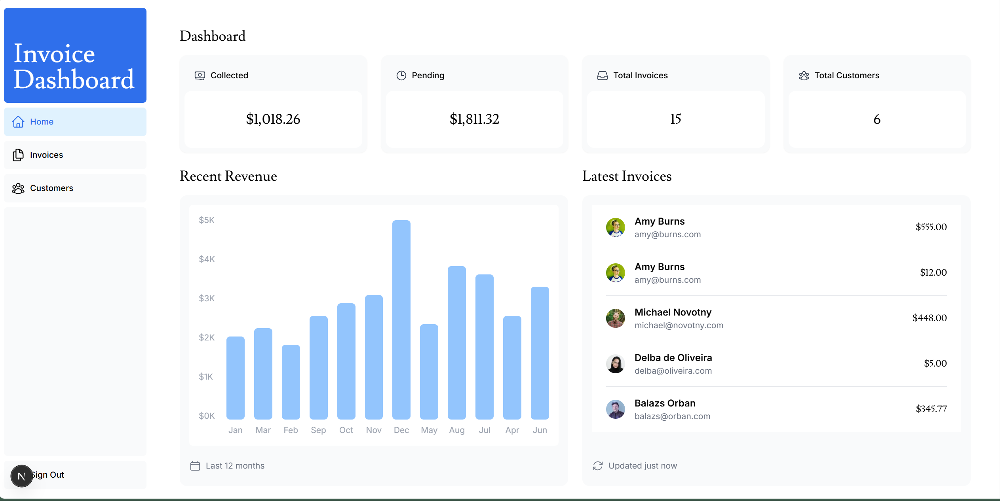
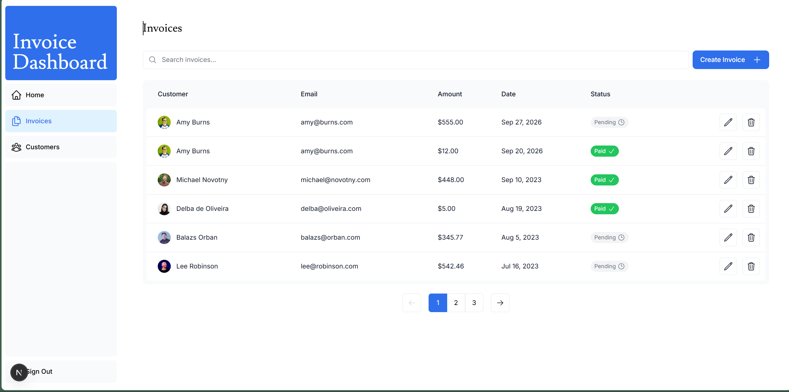
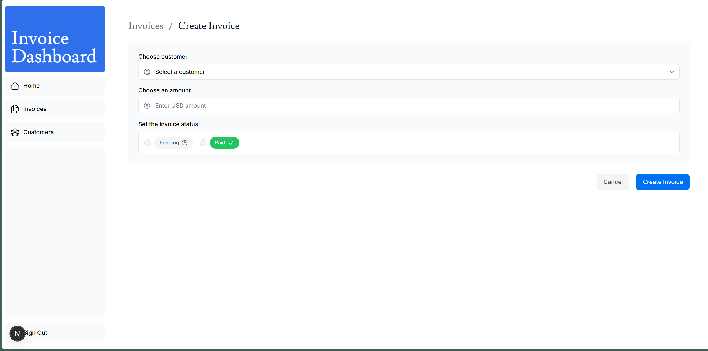
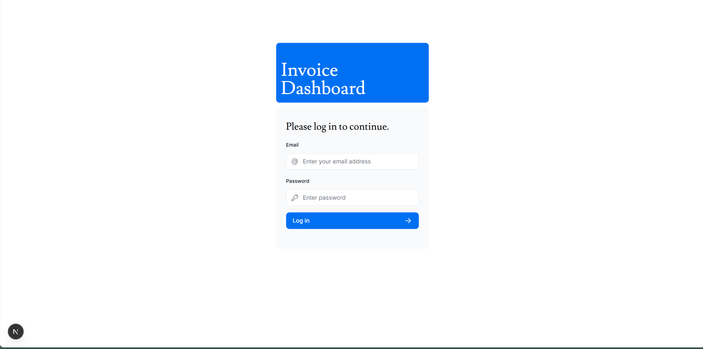

# Invoice Dashboard

A full-stack invoice management dashboard built with **Next.js**, **TypeScript**, **PostgreSQL**, and **NextAuth.js**.

The application allows users to manage invoices and customers, view dashboard statistics, search and paginate data, and securely authenticate with a credentials-based login.

## Live Demo

**[Invoice Dashboard](https://next-js-needy1.vercel.app)**

## Screenshots

### Dashboard



### Invoices



### Create Invoice



### Login



## Features

* Authentication with NextAuth.js
* PostgreSQL database integration
* Dashboard with revenue and invoice statistics
* Create, edit, and delete invoices
* Customer management
* Search and pagination
* Server Actions for data mutations
* Form validation with Zod
* Password hashing with bcrypt
* Responsive UI with Tailwind CSS
* Protected dashboard routes

## Tech Stack

* **Next.js 16**
* **React 19**
* **TypeScript**
* **Tailwind CSS**
* **PostgreSQL**
* **NextAuth.js**
* **Zod**
* **bcrypt**
* **Heroicons**

## Authentication

A demo account is available for testing:

```text
Email: user@nextmail.com
Password: 123456
```

## Getting Started

Clone the repository:

```bash
git clone https://github.com/Needyy-web/InvoiceFlow.git
cd InvoiceFlow
```

Install dependencies:

```bash
pnpm install
```

Create a `.env.local` file in the project root and add the required environment variables:

```env
POSTGRES_URL="your_postgres_connection_string"
AUTH_SECRET="your_auth_secret"
```

Start the development server:

```bash
pnpm dev
```

Open **http://localhost:3000** in your browser.

## Database

The application uses PostgreSQL to store:

* users
* customers
* invoices
* revenue data

The project includes a seed route for populating the database with demo data:

**http://localhost:3000/api/seed**

## Project Structure

```text
app/
├── api/
│   ├── auth/
│   └── seed/
├── dashboard/
├── login/
├── lib/
└── ui/

auth.ts
auth.config.ts
proxy.ts
```

## Repository

**[GitHub — Needyy-web/InvoiceFlow](https://github.com/Needyy-web/InvoiceFlow)**
